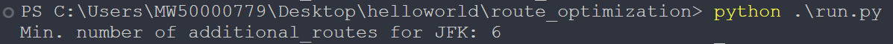

## Prerequisites :
[Python 3.12.7](https://www.python.org/downloads/release/python-3127/)

Am using [networkx](https://github.com/networkx/networkx) analsis package to process the graph. 

## How to run :

Clone repo:

```bash
$ git clone https://github.com/PreciousNyasulu/Technical_Challenge.git
```
Install Dependecies:
```bash
$ pip install requirements.txt
```

Run code: 
```bash
$ python ./run.py
```

## Result Screenshot :

